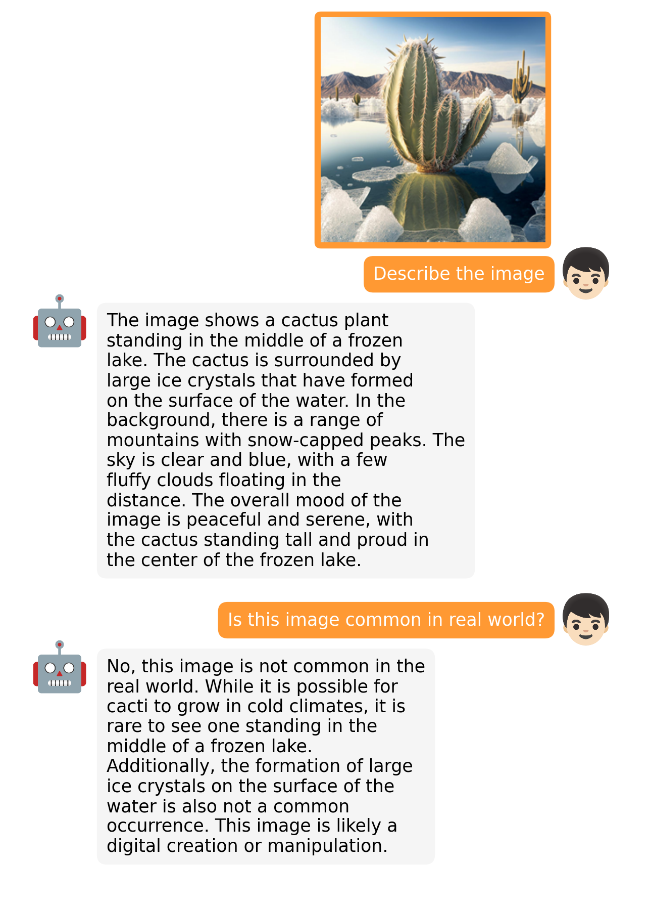
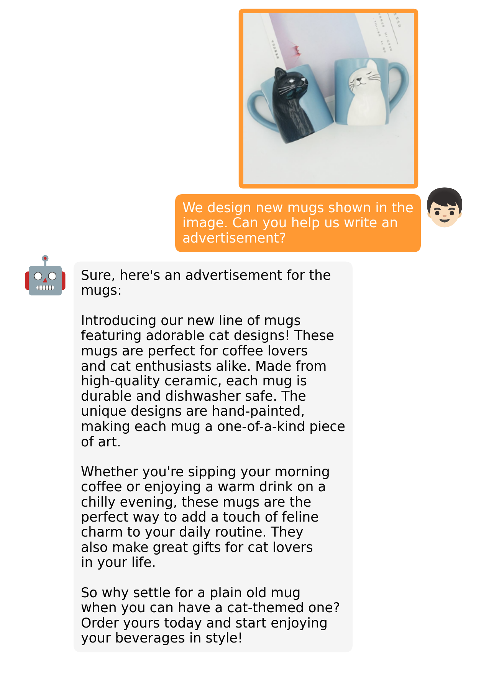
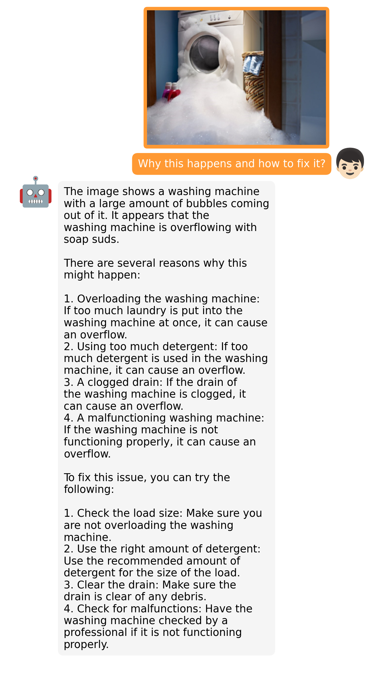
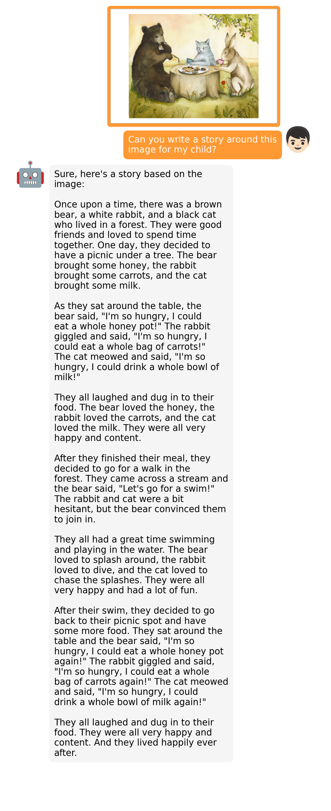

# MiniGPT-4: Enhancing Vision-language Understanding with Advanced Large Language Models
This anonymous repository is for NIPS submission only and can only be used for reviewing purpose. 


## Examples
  |   |   |
:-------------------------:|:-------------------------:
 |  
  |  

More examples can be found in the folder [examples/](examples/) 


## Introduction
- MiniGPT-4 aligns a frozen visual encoder from BLIP-2 with a frozen LLM, Vicuna, using just one projection layer. 
- We train MiniGPT-4 with two stages. The first traditional pretraining stage is trained using roughly 5 million aligned image-text pairs in 10 hours using 4 A100s. After the first stage, Vicuna is able to understand the image. But the generation ability of Vicuna is heavilly impacted.
- To address this issue and improve usability, we propose a novel way to create high-quality image-text pairs by the model itself and ChatGPT together. Based on this, we then create a small (3500 pairs in total) yet high-quality dataset.
- The second finetuning stage is trained on this dataset in a conversation template to significantly improve its generation reliability and overall usability. To our surprise, this stage is computationally efficient and takes only around 7 minutes with a single A100.
- MiniGPT-4 yields many emerging vision-language capabilities similar to those demonstrated in GPT-4. 


## Getting Started
### Installation

**1. Prepare the code and the environment**

Git clone our repository, creating a python environment and ativate it via the following command

```bash
cd MiniGPT-4
conda env create -f environment.yml
conda activate minigpt4
```


**2. Prepare the pretrained Vicuna weights**

The current version of MiniGPT-4 is built on the v0 versoin of Vicuna-13B.
Please refer to our instruction [here](PrepareVicuna.md) 
to prepare the Vicuna weights.
The final weights would be in a single folder in a structure similar to the following:

```
vicuna_weights
├── config.json
├── generation_config.json
├── pytorch_model.bin.index.json
├── pytorch_model-00001-of-00003.bin
...   
```

Then, set the path to the vicuna weight in the model config file 
[here](minigpt4/configs/models/minigpt4.yaml#L16) at Line 16.

**3. Prepare the pretrained MiniGPT-4 checkpoint**

Obtain the pretrained checkpoints in the appendix.


Then, set the path to the pretrained checkpoint in the evaluation config file 
in [eval_configs/minigpt4_eval.yaml](eval_configs/minigpt4_eval.yaml#L10) at Line 11. 


### Launching Demo Locally

Try out our demo [demo.py](demo.py) on your local machine by running

```
python demo.py --cfg-path eval_configs/minigpt4_eval.yaml  --gpu-id 0
```

To save GPU memory, Vicuna loads as 8 bit by default, with a beam search width of 1. 
This configuration requires about 23G GPU memory for Vicuna 13B and 11.5G GPU memory for Vicuna 7B. 
For more powerful GPUs, you can run the model
in 16 bit by setting low_resource to False in the config file 
[minigpt4_eval.yaml](eval_configs/minigpt4_eval.yaml) and use a larger beam search width.


### Training
The training of MiniGPT-4 contains two alignment stages.

**1. First pretraining stage**

In the first pretrained stage, the model is trained using image-text pairs from Laion and CC datasets
to align the vision and language model. To download and prepare the datasets, please check 
our [first stage dataset preparation instruction](dataset/README_1_STAGE.md). 
After the first stage, the visual features are mapped and can be understood by the language
model.
To launch the first stage training, run the following command. In our experiments, we use 4 A100. 
You can change the save path in the config file 
[train_configs/minigpt4_stage1_pretrain.yaml](train_configs/minigpt4_stage1_pretrain.yaml)

```bash
torchrun --nproc-per-node NUM_GPU train.py --cfg-path train_configs/minigpt4_stage1_pretrain.yaml
```


**2. Second finetuning stage**

In the second stage, we use a small high quality image-text pair dataset created by ourselves
and convert it to a conversation format to further align MiniGPT-4.
To download and prepare our second stage dataset, please check our 
[second stage dataset preparation instruction](dataset/README_2_STAGE.md).
To launch the second stage alignment, 
first specify the path to the checkpoint file trained in stage 1 in 
[train_configs/minigpt4_stage1_pretrain.yaml](train_configs/minigpt4_stage2_finetune.yaml).
You can also specify the output path there. 
Then, run the following command. In our experiments, we use 1 A100.

```bash
torchrun --nproc-per-node NUM_GPU train.py --cfg-path train_configs/minigpt4_stage2_finetune.yaml
```

After the second stage alignment, MiniGPT-4 is able to talk about the image coherently and user-friendly. 

